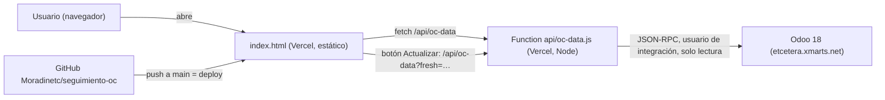

# Seguimiento OC · Control Directivos

> Tablero para Dirección y Compras que muestra, en vivo directo desde Odoo, el estado de cada orden de compra (OC): si ya llegó, si ya se pagó, en qué contenedor viene, cuándo llega y cuánto costó traerla.

## 1. Ficha rápida

| | |
|---|---|
| **Qué es** | Dashboard de solo lectura (HTML/JS de un archivo + 1 function serverless que lee Odoo) |
| **Usuarios** | Dirección y gerencias; equipo de Compras e Importaciones. ⚠️ Por confirmar: lista exacta de usuarios |
| **URL de producción** | https://seguimiento-oc.vercel.app/ |
| **Código fuente** | GitHub `Moradinetc/seguimiento-oc` (privado), rama `main` |
| **Hosting** | Vercel — proyecto `seguimiento-oc`, equipo `etcetera-accesorios` |
| **Fuentes de datos** | Odoo 18 (`etcetera.xmarts.net`) directo por JSON-RPC, solo lectura. Sin BigQuery ni base intermedia |
| **Responsable** | Coordinación de Sistemas (IT) |
| **Estado** | En producción |
| **Documentado** | 08/10/2026 — versión que lee directo de Odoo |

Versión anterior: un snapshot estático en Netlify (`lambent-pothos-bb13c2.netlify.app`) con los datos incrustados en el HTML. Del 07/10/2026 al 08/10/2026 la versión de Vercel leyó de BigQuery; desde el 08/10/2026 lee directo de Odoo (ver historial).

## 2. Para qué sirve

Las compras de etcétera se hacen sobre todo a proveedores en China y llegan en contenedores marítimos, aéreos o terrestres. Antes, saber "¿qué tenemos comprado, qué ya llegó, qué está pagado y qué viene en camino?" implicaba cruzar a mano varias pantallas de Odoo (Compras, Inventario, Contabilidad y el módulo de contenedores).

Este tablero junta esa información en un solo lugar. Dirección lo usa para ver el monto comprometido, el avance de recepción y pagos y los embarques atrasados. Compras e Importaciones lo usan para dar seguimiento a cada contenedor y para revisar cuánto pesan los gastos de logística e impuestos sobre el valor de la mercancía (costeo por arribo).

Es de **solo lectura**: no modifica nada en Odoo.

## 3. Glosario

| Término | Significado |
|---|---|
| **OC** | Orden de compra en Odoo (`purchase.order`, nombres como `P00123`). |
| **Cotización** | OC en estado `draft` (aún no confirmada). Se muestra aparte, no cuenta en los totales. |
| **OC aprobada** | OC confirmada, `state = 'purchase'`. Son las que suman en el tablero. |
| **Recepción** | `receipt_status` de la OC en Odoo: `full` (completa), `partial` (parcial) y cualquier otro valor (`pending`/vacío) = no recibida. |
| **Arribo** | Nombre del embarque al que se asigna la OC (`x_nombre_arribo_oc`, campo personalizado). Un arribo agrupa varias OCs. |
| **Contenedor** | Registro del modelo de contenedores de Odoo (`containers_move`), con nombres como `RCP/IN/0026`. Se liga a las OCs a través de las recepciones (`stock_picking`). |
| **Estados de contenedor** | `or` En origen · `tr` En tránsito · `ad` En aduana · `de` Despachado · `ar` Arribado. |
| **Transporte** | `ma` Marítimo · `ai` Aéreo · `te` Terrestre. |
| **ETA** | Fecha estimada de llegada del contenedor (`expected_date`). |
| **Landed cost / costeo** | Gastos de importación prorrateados a la mercancía (`stock_landed_cost_lines`): impuestos y gastos operativos. |
| **PRV, IGI, DTA** | Impuestos de importación: prevalidación, impuesto general de importación y derecho de trámite aduanero. |
| **CEDIS** | Almacén central de etcétera, destino de los contenedores. |
| **MXN** | Todos los montos se muestran en pesos: `amount_total / currency_rate` de la OC. |

## 4. Cómo se usa

La barra superior tiene cinco botones de navegación (**Resumen, Órdenes, Embarques, Gastos, Costeo**) y el botón **Periodo**. En el encabezado están la fecha de los datos ("Datos de Odoo al …"), el botón **↻ Actualizar** y el botón **?**.

**Filtro de periodo (global).** Al abrir **Periodo ▾** se elige *Todo*, *Este año*, un *Mes* o un *Rango personalizado* (Desde/Hasta). Filtra por **fecha de la OC** (`date_order`), así que afecta Resumen, Órdenes y Embarques por arribo. **No afecta** Tracker, Calendario, Gastos ni Costeo, porque esas vistas se organizan por contenedor y no por fecha de OC.

### 4.1 Resumen

Tiene dos sub-pestañas:

- **Recepción y pagos.** Tarjetas con número de OCs, monto total, recibidas completas, parciales y no recibidas, y estatus de pago (pagadas, no pagadas, parciales, sin factura, monto pendiente). Cada tarjeta trae una pastilla con *piezas · monto* del grupo. Si hay cotizaciones, aparece una barra delgada con su conteo.
- **Producción y logística.** Pendientes de llegar, atrasadas, por llegar, en producción, producción programada y sin dato de producción.

Debajo están la tabla **Estatus general de compras** (pendientes, aprobadas, en tránsito, recibidas, canceladas, con OCs, piezas, SKU's y monto), **Proveedores por monto** (todos, ordenados de mayor a menor, con buscador `#provSearch` solo por nombre de proveedor: ignora mayúsculas y acentos, conserva el lugar original en el ranking y recalcula el total con los visibles), **Próximas llegadas** (los 6 contenedores no arribados con ETA más cercana) y la gráfica **OCs y monto por mes**: barras = número de OCs, línea dorada = monto, por mes de `date_order`.

### 4.2 Órdenes

Tabla detallada de OCs aprobadas con filtros agrupados: **Recepción** (todas/recibidas/parciales/no recibidas), **Pago** (todas/pagadas/no pagadas/parcial/sin factura) y **Otros** (atrasadas, en producción).

- **✕ Limpiar** quita los filtros.
- **⬇ Exportar Excel** descarga `ordenes-de-compra.csv` (UTF-8 con BOM para que Excel respete los acentos).

Las columnas OC y Proveedor quedan fijas al desplazar en horizontal. La barra de totales vive fuera del área con scroll para que siempre se vea. Cualquier columna se ordena con clic en el encabezado (primero de mayor a menor). La tabla se pagina con ← Anterior / Siguiente →.

### 4.3 Embarques

Un selector alterna dos vistas:

- **Embarques por arribo.** OCs agrupadas por arribo, con recibidas, parciales, no recibidas, piezas y monto. Al dar clic en un arribo se ven sus OCs. Tiene un **buscador con chips** en el encabezado (`#embChipBox`, `#embSearch`), **compartido con el Tracker**. Se escribe un arribo y aparece una **lista de sugerencias propia** (`#embSug`, no la nativa del navegador) con los arribos del periodo, sus OCs y monto, lo escrito resaltado, sin repetir los ya agregados; se navega con ↑ ↓ y se elige con Enter o clic. Con **Enter** o coma el texto se vuelve chip (si hay un arribo resaltado, se agrega ese; con el campo vacío Enter no agrega nada); se pueden agregar varios y se muestran los arribos que coincidan con **cualquiera** (OR). Un chip que es nombre exacto de arribo filtra por ese arribo; cualquier otro texto es *texto libre* (chip gris) y busca en arribo, folio de OC, proveedor o contenedor. × o Backspace quitan chips; **Limpiar** los quita todos. Los chips se guardan en `localStorage` (`seguimiento-oc:chips-embarques`) de ese navegador. Cada vista muestra su conteo ("N de M arribos" / "N de M contenedores"). Una OC **dividida** en varios arribos (campo `x_nombre_arribo_oc` = "Air #4-26, Air #5-26") cuenta en cada arribo con las piezas, recibidas y SKUs de sus recepciones en ese arribo y su monto exacto (piezas × precio de la OC), marcada con la etiqueta *dividida N.N %* (porcentaje real de las piezas de la OC; entre todas sus partes suman 100.0 %); el total de la tabla la cuenta una sola vez.
- **Tracker de embarques.** Usa el mismo buscador: encuentra contenedores por folio, arribo, transportista, aduana, folio de cualquier OC que traiga (campo `ocs` de cada contenedor) o proveedor de esas OCs. Un renglón por contenedor (los que se cerraron por recepción llevan la nota *por recepción* bajo el estatus): estatus, ubicación estimada, puntualidad, transporte, piezas, ETA, llegada real, días transcurridos, días de retraso, % de avance, OCs, monto, gasto logístico, % del gasto sobre el producto, transportista y aduana. Se filtra por estatus y por puntualidad (selects de color) y se ordena por cualquier columna.

### 4.4 Calendario (inaccesible en la versión actual)

El código incluye un calendario mensual de llegadas (panel `#tabCalendario`, funciones `renderCalendario()` y `renderCalDetalle()`). Muestra OCs por fecha planeada, salidas de origen, ETAs, llegadas reales y días con atraso, y abre un detalle por día. Sin embargo, **la versión desplegada no tiene ningún botón que lo abra**: el ícono que lo mostraba se perdió en una edición y solo quedó su CSS (`.cal-icon-btn`). Para restaurarlo hay que agregar un botón que llame `mostrarPanelEmb('calendario')`. Ver secciones 14 y 16.

### 4.5 Gastos

Total de gastos logísticos y su porcentaje sobre el valor de la mercancía de esos contenedores. Separa **impuestos (PRV·IGI·DTA)** de **gastos operativos**, los reparte por tipo de transporte y lista cada concepto con número de líneas, monto y % del total. Los conceptos de *demora*, *almacenaje* y *sobrestadía* se consideran evitables.

### 4.6 Costeo

Una tarjeta por arribo/contenedor con el desglose tipo "hoja de costeo": factura (valor de la OC en MXN), cada impuesto, subtotal de impuestos, cada gasto, subtotal de gastos, total de logística, **TOTAL COMPRA** y el reparto Producto % / Logística %. También muestra SKUs, número de proveedores y días de tránsito.

Filtro *Con costeo logístico* (por defecto) o *Todos los arribos*, y buscador por arribo, contenedor o proveedor. El IVA de importación aparece como "no en Odoo" porque no se registra ahí.

### 4.7 Otros elementos

- **Tooltips propios** (`#etcTip`): todo elemento con `title` o `data-tip` usa el tooltip del tablero (fondo ciruela, primera línea en dorado si hay varias), no el nativo del navegador. Un `MutationObserver` convierte los `title` en `data-tip` en cuanto se pintan; se ocultan al hacer clic, teclear, desplazar o si el elemento desaparece; en pantallas táctiles se muestran 3.5 s al tocar. Para agregar uno nuevo basta con poner `title="…"` (o `data-tip`, con `\n` para varias líneas).
- **Marca en "Pz rec."** (`celdaRecibidas()`): **▼ rojo** si la OC está *Recibida* pero llegó menos de lo pedido (el pendiente se canceló en Odoo; tooltip con piezas y %), **▲ verde** si llegó de más. Un faltante todavía pendiente de recibir no se marca. Aparece en Órdenes y en el detalle de cada arribo. En una **OC dividida**, la fila de cada arribo compara la *Demanda* contra lo *recibido en ese arribo* (no los totales de la OC); el faltante/sobrante de toda la OC se muestra en el tooltip de la etiqueta *dividida* (`difOC()`). Si Odoo no indica qué llegó en cada arribo, la fila muestra "—" y no se marca.
- **Botón ↻ Actualizar** (`#btnActualizar`): consulta Odoo en ese momento (`/api/oc-data?fresh=<marca de tiempo>`, sin caché), repinta todo conservando el periodo elegido y muestra un aviso. Si Odoo falla, avisa en rojo y deja los datos anteriores. Después de usarse queda bloqueado 30 s para no saturar Odoo.
- **Fecha de los datos** (`#dataStamp` y pie `#footerInfo`): *"Datos de Odoo al dd/mm/aaaa hh:mm"* es la hora real en que se consultó Odoo (campo `snapshot` de la respuesta), no la hora en que se abrió la página.
- **Botón ?** (`#btnAyuda`): abre el manual de usuario `manual.html` en otra pestaña. Funciona aunque los datos no hayan cargado.

## 5. Arquitectura



El navegador descarga `index.html`, que no trae datos. Al cargar, llama a `/api/oc-data`. Esa function corre en Vercel, se autentica en Odoo con un usuario de integración (credenciales en variables de entorno de Vercel) y hace **8 o 9 llamadas JSON-RPC** (`authenticate`, 6 `search_read` en paralelo, costeo y, si hay OCs divididas, sus movimientos). Con eso arma un solo JSON con el mismo formato que tenía la versión de BigQuery, así el front no cambió. El navegador hace todo lo demás (filtros, KPIs, gráficas, ordenamiento) en memoria.

**No se guarda nada:** no hay base de datos intermedia ni corte nocturno. Cada consulta sale de Odoo en ese momento.

**Frescura y protección de Odoo:** una carga normal de la página puede reutilizar por 2 minutos la respuesta que Vercel ya tenga (`s-maxage=120, stale-while-revalidate=60`), para que si varias personas abren el tablero a la vez no se consulte Odoo varias veces. El botón **Actualizar** salta esa caché siempre (`?fresh=` con marca de tiempo y `Cache-Control: no-store`). La hora que se muestra es la de la consulta real a Odoo.

**Volumen:** ~507 OCs, ~4,400 líneas, ~450 recepciones con contenedor, ~17 facturas de importación, ~61 contenedores y ~512 líneas de costeo (octubre 2026). La consulta completa tarda unos segundos; `vercel.json` le da hasta 60 s.

## 6. Fuentes de datos y reglas de negocio

### 6.1 Fuentes

Todas se leen de Odoo con `search_read`, solo lectura, con `active_test: false`.

| Modelo de Odoo | Filtro | Para qué se usa |
|---|---|---|
| `purchase.order` | todas | OCs: proveedor (`x_nombre_prov`), fechas, estado, monto, tipo de cambio, arribo (`x_nombre_arribo_oc`), producción (`x_studio_fecha_de_produccin`), comprador (`user_id`) |
| `purchase.order.line` | `display_type = false` | Piezas pedidas y recibidas, SKUs distintos por OC |
| `stock.picking` | `container_id != false` | Liga contenedor ↔ OC (`origin` + `container_id`), estado y fecha de validación (llegada por recepción) y arribo de cada recepción (`x_studio_arribo`) |
| `x_nombre_arribo` | todos | Catálogo de arribos (nombre de cada id de `x_studio_arribo`). Opcional: si falla, se reparte en partes iguales |
| `stock.move` | recepciones de OCs divididas | Piezas de cada recepción para repartir la OC entre arribos. Opcional |
| `containers.move` | todos | Estado, transporte, fechas, costeo ligado (`landed_cost_id`), transportista (`shipment_by`) y aduana (`customs`) |
| `stock.landed.cost.lines` | `cost_id` en los costeos de los contenedores | Conceptos y montos de gastos de importación |
| `account.move` | `move_type = in_invoice`, `state = posted`, `invoice_origin != false` | Facturas de proveedor: estatus de pago y saldo pendiente |

### 6.2 Cómo se arma la respuesta (función `construir()` en `api/oc-data.js`)

La respuesta tiene las llaves `_todos`, `containers`, `gastosDesglose`, `costeoExtra`, `snapshot` (hora de la consulta a Odoo, ISO UTC) y `fuente: "odoo"`. Reproduce exactamente las reglas de las consultas SQL que se usaban con BigQuery:

- **`_todos`**: una fila por OC en estado `purchase`, `done` (bloqueada, se entrega como `purchase`), `draft` o `cancel`. Agrega piezas y SKUs de las líneas, el último contenedor ligado (mayor `id`) y el estatus de pago a partir de sus facturas. Trae además `comprador_nombre`. El front la separa en `ordenes`, `cotizaciones` y `canceladas`.
- **`containers`**: una fila por contenedor, con fechas, número de OCs, monto en MXN, piezas, arribos (unidos con `|`), gasto logístico y los nombres de transportista y aduana (`transportista_nombre`, `aduana_nombre`).
- **`gastosDesglose`**: una fila por línea de costeo (`concepto` con mayúscula inicial por palabra).
- **`costeoExtra`**: por contenedor, la suma de SKUs, el número de proveedores y su lista separada por `·`.

**Trampas conocidas del modelo de datos:**

- `purchase.order.x_nombre_arribo_oc` puede traer **varios arribos separados por coma** cuando la OC se recibió en partes: se reparte (ver 6.3), nunca se agrupa por el texto completo.
- Los contenedores terrestres (`RCP/NA/...`) suelen quedarse en "En origen" aunque ya se recibieron: por eso existe la regla *Arribado por recepción*.
- `stock.picking.origin` y `account.move.invoice_origin` pueden traer **varias OCs separadas por coma** (las facturas de importación `FCIMP/...` cubren hasta 29 OCs). Se separan por coma y se recortan espacios. El saldo pendiente de una factura compartida se cuenta en cada OC que cubre.
- Los campos datetime de Odoo vienen en UTC: se convierten a fecha de `America/Mexico_City` (`dateLocal()`). Los campos tipo date se usan tal cual.
- El monto en MXN es `amount_total / currency_rate`. En Odoo, `currency_rate` es "unidades de moneda de la OC por 1 MXN".

### 6.3 Cálculos y reglas

| Indicador / estatus | Regla | Origen |
|---|---|---|
| Recibida / parcial / no recibida | `receipt_status` = `full` / `partial` / cualquier otro | `purchase_order.receipt_status` |
| Estatus de pago | Sin facturas publicadas → **sin factura**. Todas en `paid`, `in_payment` o `reversed` → **pagada**. Alguna `partial`, o mezcla de pagadas y no pagadas → **parcial**. El resto → **no pagada** | `account_move` (`move_type='in_invoice'`, `state='posted'`) |
| Monto pendiente | Suma de `amount_residual` de sus facturas publicadas | `account_move` |
| Estatus general | `cancel` → cancelada; `draft` → pendiente; recepción `full` → recibida; contenedor `tr` o `ad` → en tránsito; si no → aprobada | Función `estatusGeneral` |
| Atrasada (OC) | No recibida completa y `fecha_planeada` anterior a hoy | `date_planned` |
| Producción | No recibida completa: sin `fecha_produccion` → sin dato; fecha ≤ hoy → en producción; fecha > hoy → programada | `x_studio_fecha_de_produccin` |
| Arribado por recepción | Si el contenedor no está en `ar` en Odoo pero **todas** sus recepciones no canceladas están `done`, se trata como arribado; llegada real = fecha de la última recepción (`date_done`). Se entrega `estado_inferido: true` y `estado_odoo` con el valor original | `stock.picking.state`, `date_done` |
| Reparto de OC dividida | **Sin estimaciones.** Con recepciones etiquetadas (`stock.picking.x_studio_arribo`), cada arribo toma de sus recepciones: *Pz pedidas* = **Demanda** (`stock.move.product_uom_qty`), *Pz recibidas* = **Cantidad** de movimientos hechos (`quantity`), *SKUs* = productos distintos, **monto** = Σ demanda × precio unitario de la línea de OC (`price_subtotal / product_qty`) ÷ `currency_rate`. **% de la OC** = piezas de la parte ÷ piezas de todas las partes, 1 decimal, ajustado por mayor residuo para sumar **100.0 %** (`pctsCien()`). Si la OC **no** está *Recibida*, lo que falta por recibir y no está en ninguna recepción etiquetada (producto por producto: `product_qty` − demanda etiquetada) se agrega como parte **pendiente** con arribo vacío → renglón *Sin arribo asignado*. Si la OC ya está *Recibida*, el faltante se canceló y no se agrega. Sin ninguna recepción etiquetada **no se reparte** ("—") | `x_nombre_arribo_oc`, `x_nombre_arribo`, `stock.move`, `purchase.order.line` |
| Arribos de un contenedor | Los de sus recepciones (`x_studio_arribo`); si no tienen, los de sus OCs separados por coma | `stock.picking`, `purchase.order` |
| Puntualidad (contenedor) | Arribado → no aplica. En origen o sin ETA → en monitoreo. ETA vencida → **crítico**. ETA en ≤ 5 días → **alertado**. Si no → **en tiempo** | `estado`, `expected_date` |
| Días de retraso | Días desde la ETA si ya pasó y no ha arribado; si no, 0 | Función `diasRetrasoContenedor` |
| Días transcurridos | De `shipment_date` a `arrival_date`, o a hoy si no ha llegado | Función `diasTranscurridos` |
| % de avance | `or` 10 · `tr` 45 · `ad` 75 · `ar` 100 (`de` = 0, ⚠️ revisar si debería ir entre 75 y 100) | Constante `AVANCE_PCT` |
| Ubicación estimada | `or` Puerto origen · `ad` Aduana · `ar` CEDIS · `tr` según transporte (Alta mar / Tránsito aéreo / terrestre) | Función `ubicacionEstimada` |
| SKU's | Productos distintos por OC, sumados entre OCs (un mismo SKU en dos OCs cuenta dos veces) | `purchase_order_line.product_id` |
| Gasto logístico | Suma de `price_unit` de las líneas de costeo del contenedor | `stock.landed.cost.lines` |
| Impuestos vs operativos | Conceptos `Prv`, `Igi`, `Dta` = impuestos; el resto = operativos | Constantes `CST_IMPUESTOS` / `GASTO_IMPUESTOS` |
| Total compra (costeo) | Factura (monto MXN de las OCs del contenedor) + total de logística | Función `buildCosteoCard` |
| Comprador | Abreviatura de la tabla fija `COMPRADOR_NOMBRE` si existe; si no, el nombre del usuario en Odoo (`comprador_nombre`) | `nombreComprador()` |

## 7. Estructura del código

```
seguimiento-oc/
├── index.html        Todo el front: HTML, CSS y JS (~2,150 líneas, 169 KB; incluye logo y favicon en base64)
├── api/oc-data.js    Function de Vercel: lee Odoo por JSON-RPC y arma el JSON
├── vercel.json       maxDuration de 60 s para la function
├── package.json      Sin dependencias (usa fetch nativo de Node ≥ 18)
├── .gitignore        node_modules, .vercel, .env*
├── manual.html       Manual de usuario final (un solo archivo con capturas incrustadas, ~1.9 MB); lo abre el botón ?
└── DOCUMENTACION.md  Este archivo (documentación técnica para IT)
```

**Arranque:** al final del `<script>`, `cargarDatosVivo()` muestra "Consultando Odoo…", pide los datos con `pedirDatos(false)` y los pasa a `aplicarDatos()`, que llena `ordenes`, `cotizaciones`, `canceladas`, `containers`, `gastosDesglose`, `costeoExtra` y los nombres de compradores, escribe la fecha de los datos y llama a `populateFilterRango()` y `render()`. Si la API falla, deja en `#loading` el mensaje de error y un botón **Reintentar**. El botón Actualizar llama `actualizarDesdeOdoo()` → `pedirDatos(true)` → `aplicarDatos()`.

| Función | Qué hace |
|---|---|
| `render()` | Aplica el periodo (`applyDateFilter`) y repinta todo: KPIs, tablas, gráficas, embarques, gastos y costeo |
| `computeKPIs()` / `renderKPIs()` / `kpiCard()` | Calculan y pintan las tarjetas del Resumen |
| `renderTable()` / `filteredSorted()` / `matchesStatusFilters()` | Tabla de Órdenes con filtros, orden y paginación |
| `renderEmbarques()` / `renderContenedores()` | Embarques por arribo y Tracker |
| `renderCalendario()` / `renderCalDetalle()` | Calendario y detalle del día |
| `renderGastosLogisticos()` | Vista Gastos |
| `renderCosteo()` / `buildCosteoCard()` | Vista Costeo |
| `renderCharts()` / `renderTopProveedores()` / `renderEstatusGeneral()` / `renderProximasLlegadas()` | Bloques del Resumen |
| `enableGenericSort(tbodyId)` | Ordenamiento por clic en encabezados de cualquier tabla |
| `fmtMoney`, `fmtInt`, `fmtFecha` (dd/mm/aaaa), `fmtMoneyCompact` | Formatos |

**Navegación:** los botones `.navbtn[data-view]` activan `#view-resumen`, `#view-ordenes` o `#view-embarques`. *Gastos* y *Costeo* son paneles dentro de `#view-embarques` que se abren con `mostrarPanelEmb()`, según el mapa `NAV_PANEL`.

**Externos:** solo Google Fonts (Plus Jakarta Sans y JetBrains Mono). No usa librerías de gráficas: las gráficas son SVG generados a mano.

## 8. Configuración y accesos

| Variable / credencial | Para qué | Dónde se configura | Quién la administra |
|---|---|---|---|
| `ODOO_URL` | Dirección de Odoo, p. ej. `https://etcetera.xmarts.net` (con o sin `/odoo`) | Vercel → proyecto → Settings → Environment Variables | Sistemas |
| `ODOO_DB` | Nombre de la base de datos de Odoo | Igual | Sistemas |
| `ODOO_USER` | Usuario de integración de Odoo | Igual | Sistemas |
| `ODOO_API_KEY` | Llave API de ese usuario | Igual | Sistemas |
| Usuario de integración en Odoo | Solo lectura en Compras, Inventario, Contabilidad y Contenedores | Odoo → Ajustes → Usuarios | Sistemas |

Es la misma convención de variables de la app **Descuentos en Odoo** en Vercel. Las variables `BQ_CLIENT_EMAIL` y `BQ_PRIVATE_KEY` de la versión anterior ya no se usan y se pueden borrar de Vercel.

**Accesos que necesita alguien nuevo:** colaborador en el repo `Moradinetc/seguimiento-oc` (GitHub) y miembro del equipo `etcetera-accesorios` en Vercel. Se piden a Coordinación de Sistemas.

## 9. Despliegue

### 9.1 Producción

1. Haz el cambio y pasa el QA (sección 12).
2. Sube los archivos modificados a `main` en GitHub: **Add file → Upload files** reemplaza el archivo, o haz `git push`.
3. Vercel detecta el commit y despliega solo, en menos de 1 minuto. El avance se ve en Vercel → proyecto → Deployments.
4. Verifica abriendo `https://seguimiento-oc.vercel.app/api/oc-data` (debe empezar con `{"_todos":[`) y el tablero (el encabezado debe decir "Datos de Odoo al" con la hora actual).

La configuración del proyecto en Vercel es Framework Preset **Other**, sin build command. Vercel publica `index.html` como estático y `api/*.js` como functions.

### 9.2 Probar en local

```bash
npm i -g vercel
cd seguimiento-oc
npm install
vercel link        # una vez, elegir el proyecto seguimiento-oc
vercel env pull    # baja las variables a .env.local (no se sube a Git)
vercel dev         # http://localhost:3000
```

`vercel env pull` trae las 4 variables de Odoo. Abrir `index.html` directo con doble clic **no funciona**, porque no existe `/api/oc-data`.

### 9.3 Regresar a la versión anterior

En Vercel → Deployments, elige el deploy anterior y usa **Promote to Production** (Instant Rollback). O revierte el commit en GitHub y Vercel redespliega.

## 10. Operación diaria

- No hay tareas programadas ni cortes: los datos se consultan a Odoo cuando alguien abre el tablero (con la caché de 2 minutos) o presiona **Actualizar**.
- **Ya no depende del conector de BigQuery** ni de sus acciones planificadas. Si otros sistemas usan las tablas `purchase_order`, `account_move`, `containers_move`, etc. de BigQuery, esas siguen necesitando su programación en el conector.
- **Logs:** Vercel → proyecto → Logs (filtrar por `/api/oc-data`). Los errores muestran el mensaje de Odoo.
- **Carga sobre Odoo:** 7 llamadas de lectura por consulta. Con la caché y el bloqueo de 30 s del botón, es mínima.
- **Plan de Vercel:** la cuenta está en plan **Hobby**, que según las condiciones de Vercel es para uso no comercial. Ver sección 14.

## 11. Solución de problemas

| Síntoma | Causa probable | Qué hacer |
|---|---|---|
| "No se pudieron cargar los datos de Odoo… Faltan variables de entorno en Vercel: …" | Variables no creadas, mal escritas o creadas después del último deploy | Revisarlas en Vercel → Settings → Environment Variables (entorno *Production*) y hacer **Redeploy** |
| "Odoo rechazó el usuario o la llave API" | Usuario, base o llave incorrectos, o la llave se revocó | Revisar `ODOO_DB`, `ODOO_USER`, `ODOO_API_KEY`; generar una llave nueva en Odoo si hace falta |
| "Odoo: Access Denied" / "You are not allowed to access…" | Al usuario de integración le falta permiso de lectura en algún modelo | Darle lectura en Compras, Inventario, Contabilidad o Contenedores, según el modelo del mensaje |
| "Odoo: Invalid field …" | Se renombró o eliminó un campo en Odoo (por ejemplo un campo de Studio) | Ajustar el campo en `api/oc-data.js` |
| "Odoo respondió HTTP 502/504" o tarda mucho | Odoo saturado o en mantenimiento (Xmarts) | Reintentar en unos minutos; revisar Logs de Vercel |
| Un cambio en Odoo no se ve | La página tomó la respuesta en caché (≤ 2 min) | Presionar **Actualizar** |
| Una OC aparece sin contenedor o con pago "sin factura" | En Odoo, la recepción no tiene contenedor, o la factura no está publicada o no lleva la OC en *Documento origen* | Corregir el dato en Odoo |
| Comprador con nombre completo en lugar de abreviatura | Usuario nuevo que no está en `COMPRADOR_NOMBRE` | Opcional: agregar su abreviatura en `index.html` |
| El CSV abre con acentos raros | Se abrió con otro programa o se quitó el BOM | Abrir con Excel; el archivo ya incluye BOM UTF-8 |

## 12. Cómo hacer cambios sin romper nada

1. **La versión vigente está en GitHub (`main`)**, no en copias locales ni en el Netlify viejo.
2. **QA obligatorio antes de subir.** Congela la versión que funciona, aplica el cambio en una copia, valida la sintaxis (`node --check` del JS) y corre la prueba de humo de vistas y functions, comparando antes y después (skill `qa-despliegue-etc`). Nada que funcionaba puede dejar de funcionar.
3. **No renombres** ids del HTML, funciones globales ni las llaves del JSON (`_todos`, `containers`, `gastosDesglose`, `costeoExtra`): el front depende de ellos. Agrega, no renombres.
4. **Para leer un campo nuevo de Odoo**, confirma primero que existe y está almacenado (`ir.model.fields`), agrégalo a la lista de `fields` del `searchRead` correspondiente y luego al objeto que arma `construir()`.
5. **Para un KPI nuevo**, calcula en `computeKPIs()` y pinta con `kpiCard()` siguiendo las tarjetas existentes.
6. **Si el dato está mal en Odoo, se corrige en Odoo.** Los cambios en Odoo de producción solo los aplica Coordinación de Sistemas. La function solo lee: nunca agregues escrituras a Odoo en ella.
7. **Nunca subas credenciales al repo.** `.gitignore` ya excluye `.env*`.

## 13. Relación con otros sistemas

- **Odoo 18** es la única fuente. Cambios en los campos personalizados (`x_nombre_arribo_oc`, `x_nombre_prov`, `x_studio_fecha_de_produccin`), en el módulo de contenedores (`containers.move`) o en los permisos del usuario de integración afectan al tablero.
- **App Descuentos en Odoo** usa la misma convención de variables (`ODOO_URL`, `ODOO_DB`, `ODOO_USER`, `ODOO_API_KEY`). Si comparten usuario de integración, rotar su llave afecta a ambas.
- **BigQuery**: el tablero ya no lo usa. Las tablas `purchase_order`, `account_move`, `containers_move`, etc. siguen existiendo para otros usos y dependen de las acciones planificadas del conector.
- **Landed Cost tracker** y **Tracking cadena de suministros** muestran información parecida (costeo y marítimos). Si cambia una regla de negocio, hay que revisar que coincida en los tres.

## 14. Limitaciones conocidas y pendientes

- **Plan Hobby de Vercel** para uso comercial: conviene pasarlo a Pro.
- El **conector de Vercel en Claude** no tiene acceso al equipo `etcetera-accesorios`, así que los despliegues se hacen por GitHub. Pendiente reautorizarlo.
- El IVA de importación no está en Odoo, así que el Costeo no lo incluye.
- El estado `de` (Despachado) tiene 0 % de avance en `AVANCE_PCT`. ⚠️ Revisar si es intencional.
- **El Calendario de llegadas no se puede abrir**: falta el botón en el HTML (sección 4.4).
- Sin control de acceso: cualquiera con la URL ve el tablero. ⚠️ Por confirmar si se debe proteger (Vercel Deployment Protection o login de Odoo RH).

## 15. Historial de cambios

| Fecha | Cambio |
|---|---|
| 08/10/2026 | Etiqueta *dividida N.N %* con el **porcentaje real** (1 decimal) que **suma 100 %**; lo pendiente sin recepción etiquetada aparece como parte *Sin arribo asignado* (ej. P02139: 89.6 % + 0.2 % + 10.2 %) |
| 08/10/2026 | La etiqueta *dividida* ya no muestra porcentaje (el redondeo mostraba "100%" y "0%" en OCs con 878 y 2 piezas por arribo) |
| 08/10/2026 | **Montos sin estimar**: el monto de cada arribo de una OC dividida = piezas de sus recepciones × precio unitario de la OC (antes, % de piezas × monto de la OC); sin recepciones etiquetadas ya no se reparte 50/50 |
| 08/10/2026 | Tooltip de *dividida N%* resumido a 2–3 líneas: otros arribos · parte de este arribo (piezas, monto, %) · faltante/sobrante de toda la OC si lo hay |
| 08/10/2026 | Marca ▼/▲ de OCs divididas se calcula por arribo (antes usaba los totales de la OC y mostraba, p. ej., "4,740 → 4,750" en una fila de 3,783) |
| 08/10/2026 | Buscador por proveedor en *Proveedores por monto* (Resumen) |
| 08/10/2026 | Sugerencias del buscador con **lista propia** (antes la nativa del navegador): OCs y monto por arribo, teclado ↑ ↓ |
| 08/10/2026 | **Tooltips propios** en todo el tablero; marca de **faltante cancelado / sobrante** en piezas recibidas (ej. P01366: faltaron 137 de 1,100) |
| 08/10/2026 | Buscador con **chips** en el encabezado de Embarques/Tracker: varios arribos a la vez, autocompletar y se recuerdan en el navegador |
| 08/10/2026 | OCs divididas: piezas pedidas, recibidas y **SKUs por arribo** salen directo de las recepciones (ej. P01355 en Air #4-26: 3,783 / 3,783, igual que Odoo) |
| 08/10/2026 | Contenedores **arribados por recepción** (12 contenedores estaban recibidos pero sin cerrar en Odoo); **OCs divididas** entre arribos se reparten según sus recepciones (Air #5-26 pasa de 24 a 25 OCs); **buscador** compartido en Embarques por arribo y Tracker; cada contenedor trae la lista de sus OCs (`ocs`) |
| 08/10/2026 | Lee **directo de Odoo** por JSON-RPC (sin BigQuery ni almacenamiento); botón **↻ Actualizar**; fecha real de los datos en encabezado y pie; nombres de comprador, transportista y aduana desde Odoo; OCs bloqueadas cuentan como confirmadas. Motivo: las tablas de BigQuery del tablero no tenían acción planificada en el conector y llevaban 8 días sin actualizarse |
| 07/10/2026 | Botón **?** en el encabezado que abre el manual de usuario (`manual.html`); se agregan `manual.html` y `DOCUMENTACION.md` al repo |
| 07/10/2026 | Migración a Vercel con datos en vivo desde BigQuery (`/api/oc-data`); repo `Moradinetc/seguimiento-oc` |
| 06/10/2026 | Último snapshot estático (507 OCs, 61 contenedores) en Netlify |
| oct 2026 | Rediseño: navegación plana, periodo en popover, logo, Manual, Órdenes con filtros agrupados, export CSV, columnas fijas y totales fuera del scroll |
| jul 2026 | Primera versión del seguimiento de órdenes de compra |

## 16. Preguntas abiertas

1. ¿Quiénes son los usuarios exactos del tablero y quién decide los accesos? (Dirección)
2. ¿Logística cerrará en Odoo (estatus *Arribado* y fecha) los contenedores terrestres al recibirlos? Mientras no, el tablero los deduce por recepción. (Logística)
3. ¿El estado `de` (Despachado) debe tener un % de avance entre 75 y 100? (Importaciones)
4. ¿Se debe proteger la URL con login? (Dirección / Sistemas)
5. ¿Se pasa el proyecto a un plan Pro de Vercel? (Sistemas / Finanzas)
6. ¿Se restaura el botón del **Calendario** de llegadas? (Sistemas)

---

**Manual de usuario:** si cambia una pantalla, un botón o una regla visible para el usuario, actualiza también `manual.html`. Se regenera con la skill `manual-usuario-etc` (capturas automáticas con datos de prueba).
